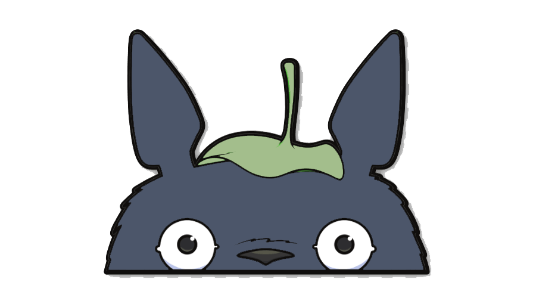

<p align="center">
<a href=#">

</a>
</p>
<h1 align="center">Totoro</h1>
<p align="center"> AI enabled kawaii social networking platform</p>

<p align="center">
Fork of <a herf="https://github.com/gauravjot/social-network">Nexus: Social Network</a>
</p>

## Run the application
This application uses celery so to start the application:

1. Start celery
    ```
    $ celery -A totoro beat -l info
    $ celery -A totoro worker -l info
    ```
2. Run redis server
    ```
    $ redis-server
    ```
3. Run the Django server
    ```
    $ python manage.py runserver
    ```
